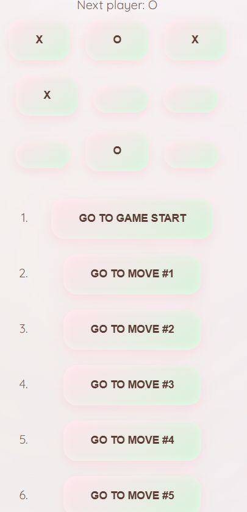

# ❌⭕ Tic Tac Toe (React)


Классическая игра "Крестики-нолики", разработанная на React.
Два игрока по очереди делают ход. Побеждает тот, кто первым соберёт 3 символа в ряд.

---


## 🎮 Возможности

* ❌⭕ Игра для двух игроков
* 🔄 Автоматическая смена хода
* 🏆 Определение победителя
* 🤝 Ничья
* 🔁 Перезапуск игры
* 📱 Адаптивный интерфейс

---

## 🛠️ Технологии
| Технология | Назначение |
|------------|------------|
|⚛️  React | Построение пользовательского интерфейса |
|📜  JavaScript (ES6+) | Логика приложения |
|🎨  CSS3 | Стилизация |
|🧩  JSX | Разметка внутри компонентов |
|🗂️  Node.js / npm | Управление зависимостями |
|📦 Create React App |

---

## 🚀 Установка и запуск

```bash
git clone https://github.com/твой-логин/tic-tac-toe.git
cd tic-tac-toe
npm install
npm start
```

Открой в браузере:
http://localhost:3000

---

## 🏗️ Production сборка

```bash
npm run build
```

---

## 🌐 Демо

👉(https://69a810fc584120052d642615--zingy-souffle-64530c.netlify.app/)

---

## 👨‍💻 Автор

Nurbek
